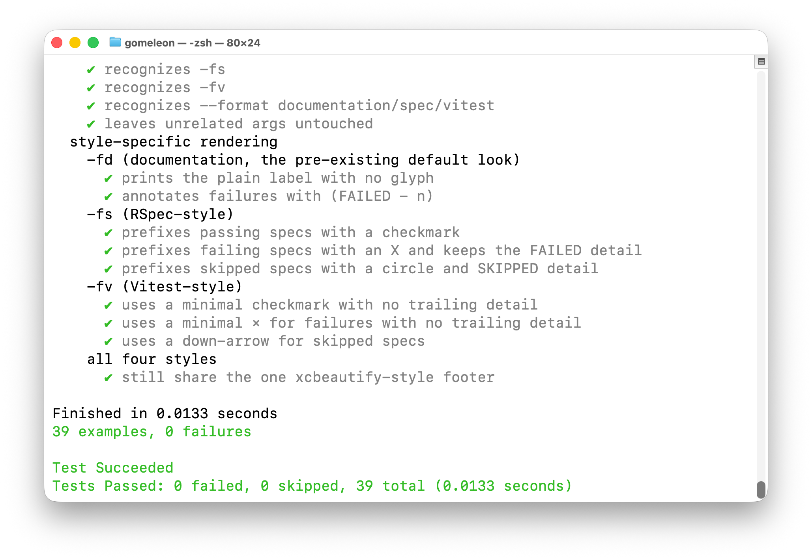

# gomeleon

[](https://github.com/woodie/gomeleon)
[](https://github.com/woodie/gomeleon/actions/workflows/go.yml)
[](https://github.com/woodie/gomeleon/releases/latest)
[](LICENSE)



The `gomeleon` command uses [Ginkgo](https://github.com/onsi/ginkgo) under the hood to emulate the style of [RSpec](https://github.com/rspec/rspec) "format documentation" output.

## Installation

Install Ginkgo if you haven't already:

```
go install github.com/onsi/ginkgo/v2/ginkgo@latest
```

Then install gomeleon:

```
go install github.com/woodie/gomeleon@latest
```

Or build locally:

```
go mod tidy
go build -o gomeleon
mv gomeleon ~/go/bin/
```

## Usage

Run as a wrapper around `ginkgo`, passing any arguments through:

```
gomeleon
gomeleon ./...
gomeleon -v ./mypackage
```

Or format an existing report file directly:

```
gomeleon report.json
```

### Formats

`gomeleon` supports four leaf-line formats, matching the same `-fd`/`-fs`/`-fv` surface as `gorderly` and `xctidy`:

| Flag | `--format` equivalent | Look |
| --- | --- | --- |
| _(none)_ | | Classic — glyph plus full detail (the original, default look) |
| `-fd` | `--format documentation` | Plain colored label, no glyph (RSpec's "documentation" format) |
| `-fs` | `--format spec` | Glyph plus grayed-out label (RSpec's "spec" format) |
| `-fv` | `--format vitest` | Minimal glyph, no trailing detail (Vitest's look) |

```
gomeleon -fd ./...
gomeleon -fs ./...
gomeleon -fv ./...
gomeleon --format spec ./...
```

All four formats share one footer (the xcbeautify-style `Test Succeeded`/`Tests Passed` block).

Sample leaf lines for a passing, a failing, and a skipped spec, across all four formats:

```
# (none) — Classic
✔ creates the directory (0.0100 seconds)
✗ creates the directory (FAILED - 1)
○ creates the directory (SKIPPED)

# -fd — documentation
creates the directory
creates the directory (FAILED - 1)
creates the directory (SKIPPED)

# -fs — spec
✔ creates the directory
✗ creates the directory (FAILED - 1)
○ creates the directory (SKIPPED)

# -fv — vitest
✓ creates the directory
× creates the directory
↓ creates the directory
```

Full sample output (Classic):

```
Something
  checkAttachmentDir
    when the path is missing
      ✔ creates the directory (0.0100 seconds)
      ✔ does not error (0.0100 seconds)
    when the path is a symlink
      ✔ does not error (0.0100 seconds)

Finished in 0.0300 seconds
3 examples, 0 failures

Test Succeeded
Tests Passed: 0 failed, 0 skipped, 3 total (0.0300 seconds)
```
